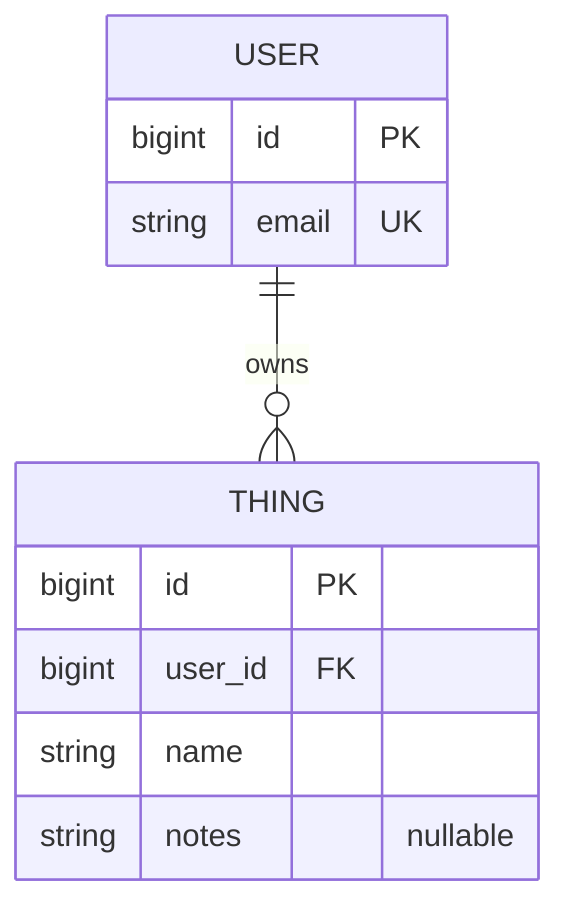

# Moviebox API Proposal

## 1. The pitch (one paragraph)
The api would pull movie and show data including reviews, how long it is, each episode, similar movies. 
People who like to watch movies and tv shows. The app would make it easier to keep track of 
everything since it would all be in one place.

## 2. Resources
| Resource       | Key fields | Relationships |
|----------------|---|---|
| User           | id, username, email, role | a User has many Lists, Favorites, Ratings, and a Watchlist |
| Movie          | id, title, overview, runtime, release_date, poster_path, backdrop_path | a Movie has many Reviews, Images, and Similar Movies |
| Session        | session_id, user_id, expires_at | a Session belongs to a Userkdrop_path | a TV Show has many Seasons, Episodes, Reviews, Images |
| Episode        | id, name, episode_number, season_number, runtime, air_date | an Episode belongs to a TV Show |
| Review         | id, author, content, rating, created_at | a Review belongs to a Movie, TV Show, or Episode |
| Image          | file_path, width, height, aspect_ratio | an Image belongs to a Movie or TV Show |
| List           | id, name, description, user_id | a List belongs to a User and has many Movies/TV Shows |
| Watchlist Item | id, user_id, media_type, media_id | a Watchlist Item belongs to a User and references a Movie/TV Show |
| Favorite Item  | id, user_id, media_type, media_id | a Favorite Item belongs to a User and references a Movie/TV Show |
| Rating         | id, user_id, media_type, media_id, score | a Rating belongs to a User and references a Movie, TV Show, or Episode |
| Session        | session_id, expires_at | a Session belongs to a User |

## 3. ER sketch
Tables, primary and foreign keys, and cardinality. Edit this Mermaid diagram (it renders on GitHub;
try changes at https://mermaid.live):

## 4. Endpoints
| Verb | Path | Auth | Purpose |
|---|---|---|---|
| GET | /api/v1/workouts?page=0&size=20 | user | list my workouts (paginated) |
| ... | ... | ... | ... |
Mark each endpoint `public`, `user`, or `admin`. Mark which collection paginates and which
filters or sorts.

## 5. Technical choices
- **Database host:** (Neon, Supabase, Railway, Atlas, ...) and why
- **OAuth2 provider:** (Google, GitHub, Auth0) and confirmation that it supports Authorization Code + PKCE from a native app
- **Repo layout:** monorepo or split, and why
These become your ADRs later.

## 6. Risks
1. **Third-Party API Rate Limiting & Image Performance:** Since the app relies heavily on the TMDB API for data and loading multiple high-resolution images (posters and backdrops) in scrolling lists, we risk hitting rate limits or causing out-of-memory (OOM) errors on the device.
    *   *How we will find out/mitigate:* In Sprint 1, we will build a prototype using an image loading library (like Coil or Glide) and the Paging 3 library to fetch and display a list of movies. We will monitor memory usage and ensure we request appropriately sized thumbnails instead of original image sizes.
2. **State Synchronization for User Data:** Keeping the user's local UI state (like hearting a favorite movie or adding to a watchlist) in sync with the remote server/API, especially across multiple screens or offline, can lead to buggy UI.
    *   *How we will find out/mitigate:* We will create a small technical spike in Sprint 1 to test an architecture using a local database (Room) as a "single source of truth". We will verify if updates to local data correctly trigger UI refreshes via Kotlin StateFlow before syncing back to the network.

## 7. Team and Sprint 1
Who owns what in Sprint 1. Link your Project board and Sprint 1 milestone.
